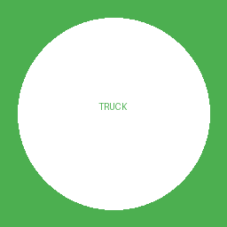

# Home Assistant Add-on: Trash Tracking



Real-time New Taipei City garbage truck tracking integrated with Home Assistant automation.

## About

This add-on tracks New Taipei City garbage trucks in real-time. When a truck approaches or passes your configured collection points, it automatically updates the status for use in Home Assistant automations.

## Features

- ✅ Real-time New Taipei City garbage truck tracking
- ✅ Customizable entry/exit collection points
- ✅ Multiple route tracking support
- ✅ RESTful API integration
- ✅ Automatic Home Assistant integration
- ✅ UI-based configuration (no YAML editing required)

## Installation

### Method 1: Local Installation (Development/Testing)

1. Go to **Supervisor** → **Add-on Store** → Three dots (top right) → **Repositories**
2. Add repository URL (if available)
3. Or manually copy the `trash_tracking_addon` folder to `/addons/` directory

### Method 2: Install from GitHub

1. Add this repository in **Add-on Store**:
   ```
   https://github.com/your-username/trash_tracking
   ```
2. Refresh the page
3. Find "Trash Tracking" and click Install

## Configuration

### Basic Configuration

Configure in the Add-on configuration page:

```yaml
location:
  lat: 25.018269          # Your latitude
  lng: 121.471703         # Your longitude
tracking:
  target_lines:           # Routes to track (leave empty to track all)
    - "C08 Afternoon Route"
  enter_point: "Minsheng Rd. Sec. 2, No. 80"    # Entry collection point
  exit_point: "Chenggong Rd. No. 23"             # Exit collection point
  trigger_mode: "arriving"                       # arriving or arrived
  approaching_threshold: 2                       # Number of stops ahead to notify
system:
  log_level: "INFO"                              # DEBUG, INFO, WARNING, ERROR
api:
  ntpc:
    timeout: 10
    retry_count: 3
    retry_delay: 2
```

### How to Find Collection Point Names

#### Using Built-in CLI Tool

1. Install and start the Add-on
2. Go to **Supervisor** → **System** → **Terminal**
3. Execute:
   ```bash
   docker exec -it addon_trash_tracking python3 cli.py --lat YOUR_LATITUDE --lng YOUR_LONGITUDE
   ```

#### Using New Taipei City Official Website

1. Visit [New Taipei City Garbage Truck Tracking](https://crd-rubbish.epd.ntpc.gov.tw/)
2. Enter your address
3. Find the exact collection point name

**Important**: Collection point names must match exactly with API responses (including spaces).

### Trigger Mode Explanation

- **arriving** (Recommended): Advance notification
  - Triggers when truck is N stops away from entry point
  - N is set by `approaching_threshold`
  - Example: Setting to 2 notifies 2 stops in advance

- **arrived**: Actual arrival notification
  - Triggers when truck reaches the entry point
  - Less preparation time

## Usage

### 1. Start the Add-on

1. After installation, click **START**
2. Check the **Log** tab to confirm successful startup
3. You should see:
   ```
   [INFO] Starting Trash Tracking Add-on...
   [INFO] Starting Flask application...
   * Running on http://0.0.0.0:5000
   ```

### 2. Configure Home Assistant Sensor

Once the Add-on is running, the API will be available at `http://localhost:5000`.

Add to your `configuration.yaml`:

```yaml
# RESTful Sensor
sensor:
  - platform: rest
    name: "Garbage Truck Monitor"
    resource: "http://localhost:5000/api/trash/status"
    scan_interval: 90
    json_attributes:
      - reason
      - truck
      - timestamp
    value_template: "{{ value_json.status }}"

# Binary Sensor
binary_sensor:
  - platform: template
    sensors:
      garbage_truck_nearby:
        friendly_name: "Garbage Truck Nearby"
        value_template: "{{ is_state('sensor.garbage_truck_monitor', 'nearby') }}"
        device_class: presence
```

### 3. Create Automations

```yaml
automation:
  # Turn on light when truck arrives
  - alias: "Garbage Truck Arrival Notification"
    trigger:
      - platform: state
        entity_id: binary_sensor.garbage_truck_nearby
        to: 'on'
    action:
      - service: light.turn_on
        target:
          entity_id: light.notification_bulb
        data:
          brightness: 255
          rgb_color: [255, 0, 0]

  # Turn off light when truck leaves
  - alias: "Garbage Truck Departure"
    trigger:
      - platform: state
        entity_id: binary_sensor.garbage_truck_nearby
        to: 'off'
    action:
      - service: light.turn_off
        target:
          entity_id: light.notification_bulb
```

## API Endpoints

### GET `/api/trash/status`

Get garbage truck status

**Response (idle)**:
```json
{
  "status": "idle",
  "reason": "No garbage truck nearby",
  "truck": null,
  "timestamp": "2025-11-18T14:00:00+08:00"
}
```

**Response (nearby)**:
```json
{
  "status": "nearby",
  "reason": "Garbage truck approaching entry point: Minsheng Rd. Sec. 2, No. 80",
  "truck": {
    "line_name": "C08 Afternoon Route",
    "car_no": "KES-6950",
    "current_rank": 10,
    "total_points": 69,
    "arrival_diff": -5,
    "enter_point": {...},
    "exit_point": {...}
  },
  "timestamp": "2025-11-18T14:05:00+08:00"
}
```

### GET `/health`

Health check endpoint

### POST `/api/reset`

Reset tracker state (for testing)

## Troubleshooting

### Add-on Won't Start

1. Check logs:
   - Go to Add-on page → **Log** tab
   - Review error messages

2. Common issues:
   - **Configuration error**: Check YAML formatting
   - **Port conflict**: Ensure port 5000 is not in use
   - **Network issue**: Verify connectivity to New Taipei City API

### Sensor Shows Unavailable

1. Confirm Add-on is running
2. Test API:
   ```bash
   curl http://localhost:5000/health
   ```
3. Verify resource URL in `configuration.yaml`

### Status Always Shows Idle

1. Verify coordinates are correct
2. Use CLI tool to check for nearby trucks:
   ```bash
   docker exec -it addon_trash_tracking python3 cli.py --lat YOUR_LATITUDE --lng YOUR_LONGITUDE
   ```
3. Ensure collection point names match exactly
4. Verify the truck route includes your configured points

### View Detailed Logs

Set log_level to DEBUG:

```yaml
system:
  log_level: "DEBUG"
```

## Support

- 📖 Full Documentation: [GitHub Repository](https://github.com/your-username/trash_tracking)
- 🐛 Issue Reporting: [GitHub Issues](https://github.com/your-username/trash_tracking/issues)
- 💬 Discussions: [GitHub Discussions](https://github.com/your-username/trash_tracking/discussions)

## License

MIT License

## Contributors

- Logan ([@iml885203](https://github.com/iml885203))

## Changelog

### 1.0.0
- Initial release
- New Taipei City garbage truck tracking support
- Home Assistant integration
- RESTful API
